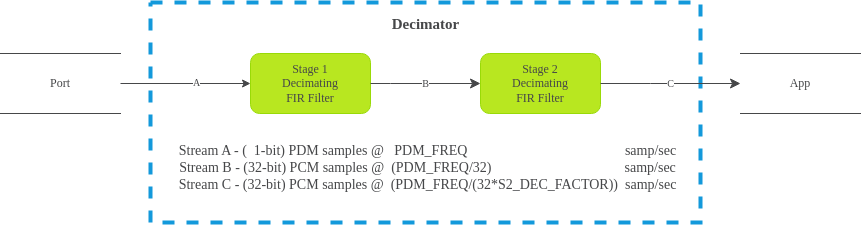
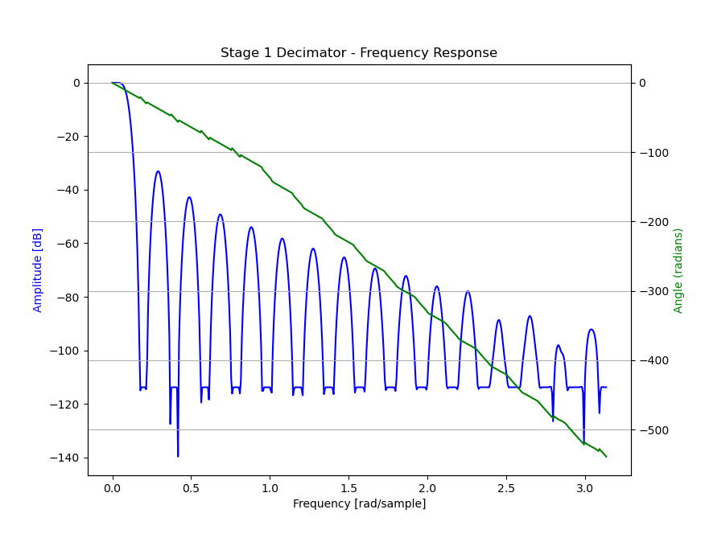
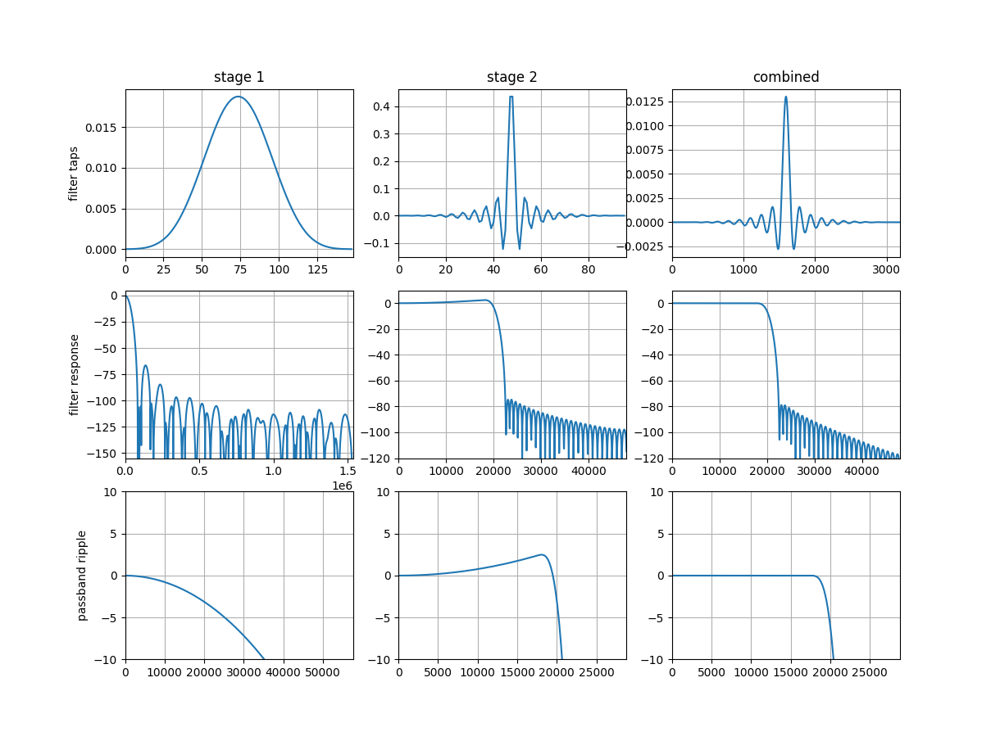

.. _decimator_stages:

Decimator Stages
================

The mic array unit provided by this library uses a two-stage decimation process
to convert a high sample rate stream of (1-bit) PDM samples into a lower sample
rate stream of (32-bit) PCM samples.

Below is a simplified model of the mic array unit.

The first stage filter is a decimating FIR filter with a fixed tap count
(``S1_TAP_COUNT``) of ``256`` and a fixed decimation factor (``S1_DEC_FACTOR``)
of ``32``.

The second stage decimator is a fully configurable FIR filter with tap count
``S2_TAP_COUNT`` and a decimation factor of ``S2_DEC_FACTOR`` (this can be
``1``).

Decimator Stage 1
-----------------

For the first stage decimating FIR filter, the actual filter coefficients used
are configurable, so an application is free to use a custom first stage filter,
as long as the tap count is ``256``. This library also provides coefficients for
the first stage filter, whose filter characteristics are adequate for most
applications.

Filter Implementation (Stage 1)
*******************************

The input to the first stage decimator (here called "Stream A") is a stream of
1-bit PDM samples with a sample rate of ``PDM_FREQ``.  Rather than each PDM
sample representing a value of ``0`` or ``1``, each PDM sample represents a
value of either ``+1`` or ``-1``. Specifically, on-chip and in-memory, a bit
value of ``0`` represents ``+1`` and a bit value of ``1`` represents ``-1``.

The output from the first stage decimator, Stream B, is a stream of 32-bit PCM
samples with a sample rate of ``PDM_FREQ/S1_DEC_FACTOR = PDM_FREQ/32``. For
example, if ``PDM_FREQ`` is 3.072 MHz, then Stream B's sample rate is 96.0 kHz.

The first stage filter is structured to make optimal use of the XCore XS3 vector
processing unit (VPU), which can compute the dot product of a pair of
256-element 1-bit vectors in a single cycle. The first stage uses 256 16-bit
coefficients for its filter taps.

The signature of the filter function is 

.. code-block:: c

  int32_t fir_1x16_bit(uint32_t signal[8], uint32_t coeff_1[]);

Each time 32 PDM samples (1 word) become available for an audio channel, those
samples are shifted into the 8-word (256-bit) filter state, and a call to
``fir_1x16_bit`` results in 1 Stream B sample element for that channel.

The actual implementation for the first stage filter can be found in
``src/fir_1x16_bit.S``. Additional usage details can be found in
``api/etc/fir_1x16_bit.h``.

Note that the 256 16-bit filter coefficients are **not** stored in memory as a
standard coefficient array (i.e. ``int16_t filter[256] = {b[0], b[1], ... };``).
Rather, in order to take advantage of the VPU, the coefficients must be
rearranged bit-by-bit into a block form suitable for VPU processing. See the
section below on filter conversion if supplying a custom filter for stage 1.

Provided Filter (Stage 1)
*************************

This library provides filter coefficients that may be used with the first stage
decimator. These coefficients are available in your application through the
header ``mic_array/etc/filters_default.h`` as ``stage1_coef``.

Filter Characteristics (Stage 1)
''''''''''''''''''''''''''''''''

The plot below indicates the frequency response of the provided first stage
decimation filter.

Filter Conversion Script
************************

Taking a set of floating-point coefficients, quantizing them into 16-bit
coefficients and 'boggling' them into the correct memory layout can be a tricky
business.  To simplify this process, this library provides a Python (3) script
which does this process for you.

The script can be found in this repository at ``script/stage1.py``.

.. todo::

  Generalize script. Currently looks for coefficients in a specific ``.pkl``
  file.

Decimator Stage 2
-----------------

An application is free to supply its own second stage filter. This library also 
provides a second stage filter whose characteristics are adequate for many or 
most applications.

Filter Implementation (Stage 2)
*******************************

The input to the second stage decimator (here called "Stream B") is the stream
of 32-bit PCM samples emitted from the first stage decimator with a sample rate
of ``PDM_FREQ/32``.

The output from the second stage decimator, Stream C, is a stream of 32-bit PCM
samples with a sample rate of ``PDM_FREQ/(32*S2_DEC_FACTOR)``. For example, if
``PDM_FREQ`` is 3.072 MHz, and ``S2_DEC_FACTOR`` is ``6``, then Stream C's
sample rate (the sample rate received by the main application code) is 

    3.072 MHz / (32*6) = 16 kHz

The second stage filter uses the 32-bit FIR filter implementation from
`lib_xcore_math <https://github.com/xmos/lib_xcore_math>`_. See
``xs3_filter_fir_s32()`` in that library for more implementation details.

Provided Filter (Stage 2)
*************************

This library provides a filter suitable for the second stage decimator. It is
available in your application through the header
``mic_array/etc/filters_default.h``.

For the provided filter ``S2_TAP_COUNT = 65``, and ``S2_DEC_FACTOR = 6``.

Filter Characteristics (Stage 2)
''''''''''''''''''''''''''''''''

The plot below indicates the frequency response of the provided second stage
decimation filter.

.. image:: stage2_freq_response.png

Custom Filters
--------------

Without writing a custom decimator implementation, the tap count and decimation
factor for the first stage decimator are fixed to ``256`` and ``32``
respectively. These can be modified for the second stage, and the filter
coefficients for both stages can be modified.

When using the C++ API to construct your application's mic array component, the
decimator's metaparameters (tap count, decimation factor) are given as C++
template parameters for the decimator class template. Pointers to the
coefficients are provided to the decimator when it is initialized.

To keep things simple, when using the vanilla API or when constructing the mic
array component using :cpp:class:`BasicMicArray
<mic_array::prefab::BasicMicArray>`, it is assumed that the filter parameters
will be those from ``stage1_fir_coef.c``, ``stage2_fir_coef.c`` and
``filters_default.h``. In this case it is recommended to simple change those
files directly with the updated coefficients. Otherwise you may need to use the
C++ API directly.

Note that both the first and second stage filters are implemented using
fixed-point arithmetic which requires the coefficients to be presented in a
particular format. The Python scripts `stage1.py` and `stage2.py`, provided with
this library, can be used to help with this formatting. See the associated README for usage details.

Configuring for 32 kHz or 48 kHz output
***************************************

Filter design scripts are provided to support higher output sampling rates than the default 16 kHz.

Both stage 1 and stage 2 need to be updated because the first stage needs a higher
cut off frequency before samples are passed to the downsample by three (32 kHz) or two (48 kHz) second stage
decimator.

From the command line, follow these instructions::

    python filter_design/design_filter.py # generate the filter .pkl files
    python stage1.py good_32k_filter_int.pkl # convert the .pkl file to a C style array for stage 1
    python stage2.py good_32k_filter_int.pkl # convert the .pkl file to a C style array for stage 2

.. note::
    Use `good_48k_filter_int.pkl` instead of `good_32k_filter_int.pkl` to support 48 kHz.

Next copy the output from last two scripts into a source file. This could be your `mic_array.cpp`
file which launches the mic array tasks. It may look something like this::

    #define MIC_ARRAY_32K_STAGE_1_TAP_COUNT 148
    #define MIC_ARRAY_32K_STAGE_1_FILTER_WORD_COUNT 128
    static const uint32_t WORD_ALIGNED stage1_32k_coefs[MIC_ARRAY_32K_STAGE_1_FILTER_WORD_COUNT]
    {
        .... the coeffs
    };

    #define MIC_ARRAY_32K_STAGE_2_TAP_COUNT 96
    static constexpr right_shift_t stage2_32k_shift = 3;

    static const int32_t WORD_ALIGNED stage2_32k_coefs[MIC_ARRAY_32K_STAGE_2_TAP_COUNT] = {
        .... the coeffs
    };

The new decimation object must now be declared that references your new filter coefficients. 
Again, this example is for 32 kHz output since the decimation factor is 3.::

    using TMicArray = mic_array::MicArray<mic_count,
        mic_array::TwoStageDecimator<mic_count, 
                                   3, 
                                   MIC_ARRAY_32K_STAGE_2_TAP_COUNT>,
        mic_array::StandardPdmRxService<MIC_ARRAY_CONFIG_MIC_IN_COUNT,
                                    mic_count,
                                    3>, 
        typename std::conditional<MIC_ARRAY_CONFIG_USE_DC_ELIMINATION,
                                    mic_array::DcoeSampleFilter<mic_count>,
                                    mic_array::NopSampleFilter<mic_count>>::type,
        mic_array::FrameOutputHandler<mic_count, 
                                    MIC_ARRAY_CONFIG_SAMPLES_PER_FRAME, 
                                    mic_array::ChannelFrameTransmitter>>;

Next you need to change how you initialise and run the mic array task to reference your new
mic array custom object. Normally the following code would be used in `ma_init()`::

    mics.Init();
    mics.SetPort(pdm_res.p_pdm_mics);
    mic_array_resources_configure(&pdm_res, MIC_ARRAY_CONFIG_MCLK_DIVIDER);
    mic_array_pdm_clock_start(&pdm_res);

however if you wish to use custom filters then the initialisation would look like this::

    mics.Decimator.Init(stage1_32k_coefs, stage2_32k_coefs, stage2_32k_shift);
    mics.PdmRx.Init(pdm_res.p_pdm_mics);
    mic_array_resources_configure(&pdm_res, MIC_ARRAY_CONFIG_MCLK_DIVIDER);
    mic_array_pdm_clock_start(&pdm_res);

Finally, the `ma_task()` function needs to be changed from the default way of calling::

    mics.SetOutputChannel(c_frames_out);
    mics.InstallPdmRxISR();
    mics.UnmaskPdmRxISR();
    mics.ThreadEntry();

to using the custom version of the object::

    mics.OutputHandler.FrameTx.SetChannel(c_frames_out);
    mics.PdmRx.InstallISR();
    mics.PdmRx.UnmaskISR();
    mics.ThreadEntry();

The increased sample rate will place a higher MIPS burden on the processor. The typical 
MIPS usage (see section :ref:`resource_usage`) is in the order of 11 MIPS per channel
using a 16 kHz output decimator.

Increasing the output sample rate to 32 kHz using the same length filters will increase
processor usage per channel to approximately 13 MIPS rising to 15.6 MIPS for 48 kHz.

Increasing the filer lengths to 148 and 96 for stages 1 and 2 respectively at 48 kHz
will increase processor usage per channel to around 20 MIPS.

Filter Characteristics for `good_32k_filter_int.pkl`
''''''''''''''''''''''''''''''''''''''''''''''''''''

The plot below indicates the frequency response of the first and second stages of the 
provided 32 kHz filters as well as the cascaded overall response. Note that the 
overall combined response provides a nice flat passband.

.. image:: 32k_freq_response.png

Filter Characteristics for `good_48k_filter_int.pkl`
''''''''''''''''''''''''''''''''''''''''''''''''''

The plot below indicates the frequency response of the first and second stages of the 
provided 48 kHz filters as well as the cascaded overall response. Note that the 
overall combined response provides a nice flat passband.

