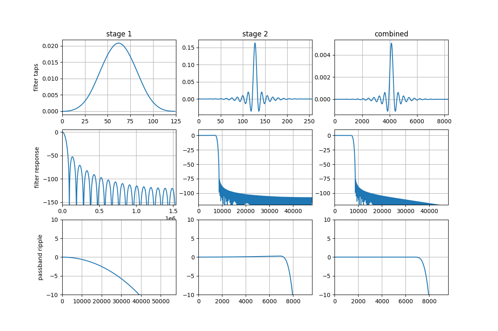
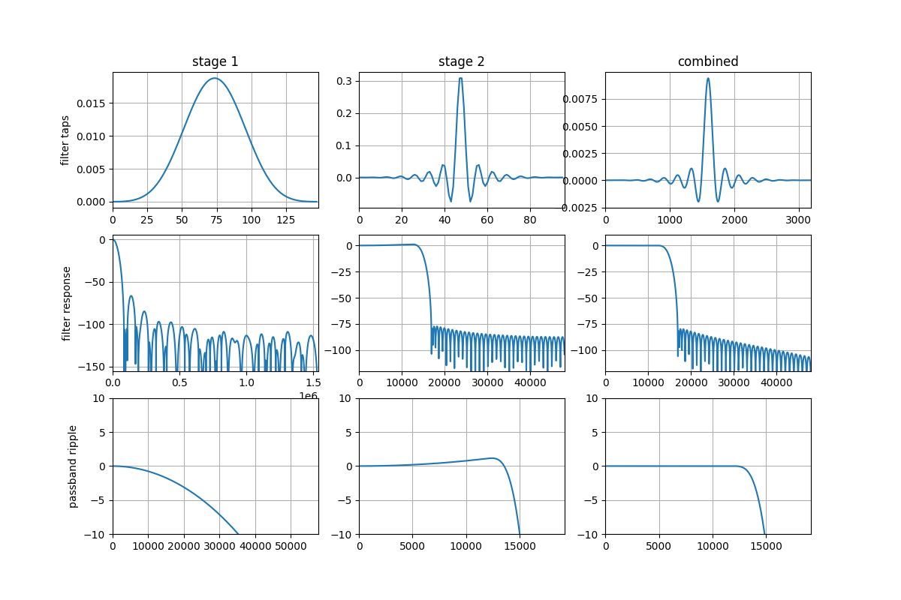
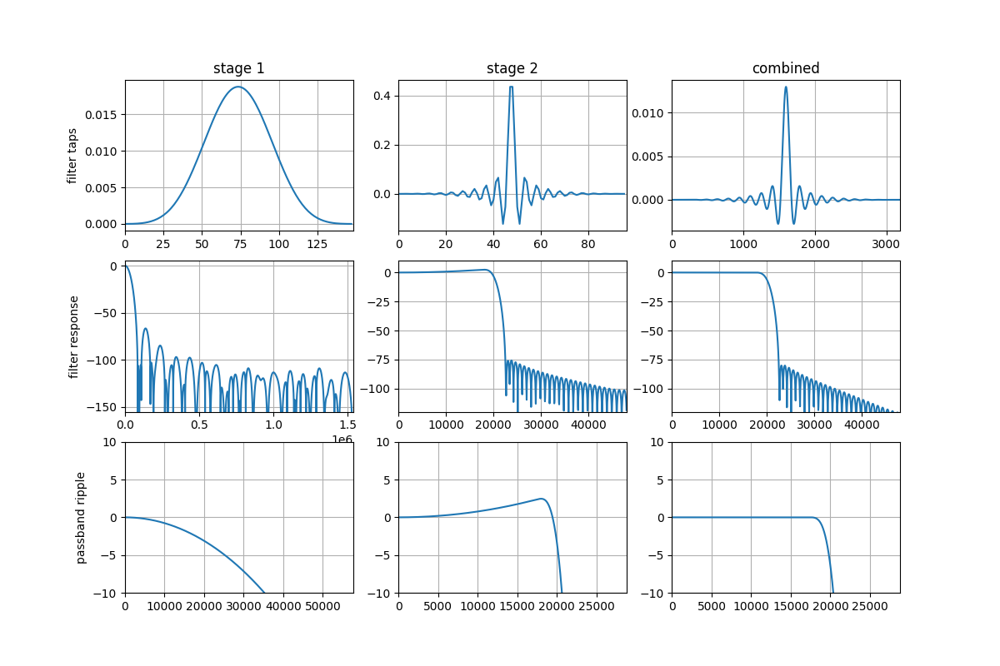

.. _decimator_stages:

******************
Decimation filters
******************

The mic array unit provided by this library uses a two-stage decimation process
to convert a high sample rate stream of (1-bit) PDM samples into a lower sample
rate stream of (32-bit) PCM samples. This is shown in :ref:`decimator_stages_simplified`.

.. _decimator_stages_simplified:

.. figure:: diagrams/decimator_stages.drawio.png
   :align: center
   :scale: 100 %

   Simplified Decimator Model

The first stage filter is a decimating FIR filter with a fixed tap count
(``S1_TAP_COUNT``) of ``256`` and a fixed decimation factor (``S1_DEC_FACTOR``)
of ``32``.

The second stage decimator is a fully configurable FIR filter with tap count
``S2_TAP_COUNT`` and a decimation factor of ``S2_DEC_FACTOR`` (this can be
``1``).

.. _default_filters:

Filters provided as part of ``lib_mic_array``
=============================================

``lib_mic_array`` provides first and second stage decimation filter coefficients for filters
targeting output sampling rates of 16 kHz, 32 kHz and 48 kHz from a starting input PDM frequency
of 3.072 MHz. The first stage decimation filters have a fixed decimation factor of ``32`` and a
fixed tap count of ``256``.

The second stage filters decimation factors vary based on the output sampling rate.

These filters are available to include in the application, through the header ``mic_array/etc/filters_default.h``

.. note::

   Although the first stage has a fixed decimation factor of 32, its
   coefficients must differ for 16 kHz, 32 kHz, and 48 kHz output sampling rate paths.
   The passband must be extended appropriately so sufficient
   bandwidth is preserved before the second stage decimates by 6 (output sampling rate 16 kHz),
   3 (output sampling rate 32 kHz), or 2 (output sampling rate 48 kHz).

The increased sample rate will place a higher MIPS burden on the processor. The typical
MIPS usage (see section :ref:`resource_usage`) is in the order of 11 MIPS per channel
using a 16 kHz output decimator.

Increasing the output sample rate to 32 kHz using the same length filters will increase
processor usage per channel to approximately 13 MIPS rising to 15.6 MIPS for 48 kHz.

Increasing the filer lengths to 148 and 96 for stages 1 and 2 respectively at 48 kHz
will increase processor usage per channel to around 20 MIPS.

Stage 1 filters
---------------

.. list-table:: Provided first stage decimation filters
   :header-rows: 1
   :widths: 12 12 20 28

   * - Output PCM sampling rate
     - Decimation factor
     - Tap count
     - Coeffs
   * - 16 kHz
     - 32
     - 256
     - ``stage1_coef``
   * - 32 kHz
     - 32
     - 256
     - ``stage1_32k_coefs``
   * - 48 kHz
     - 32
     - 256
     - ``stage1_48k_coefs``

Stage 2 filters
---------------

.. list-table:: Provided second stage decimation filters
   :header-rows: 1
   :widths: 12 12 20 28 16

   * - Output PCM sampling Rate
     - Decimation factor
     - Tap count
     - Coeffs
     - Right shift
   * - 16 kHz
     - 6
     - 64
     - ``stage2_coef``
     - ``stage2_shr``
   * - 32 kHz
     - 3
     - 96
     - ``stage2_32k_coefs``
     - ``stage2_32k_shift``
   * - 48 kHz
     - 2
     - 96
     - ``stage2_48k_coefs``
     - ``stage2_48k_shift``

Filter characteristics
----------------------

This sections provides filters characteristics of the filters provided as part of
``lib_mic_array``.

16 kHz output PCM sampling rate filter
--------------------------------------

:ref:`freq_response_16k` shows the frequency response of the first and second stages of the provided
16 kHz sampling rate filters as well as the cascaded overall response.

.. _freq_response_16k:

   16 kHz output sampling rate filter freq response

32 kHz output PCM sampling rate filter
--------------------------------------

:ref:`freq_response_32k` shows the frequency response of the first and second stages of the
provided 32 kHz sampling rate filters as well as the cascaded overall response. Note that the
overall combined response provides a nice flat passband.

.. _freq_response_32k:

   32 kHz output sampling rate filter freq response

48 kHz output PCM sampling rate filter
--------------------------------------

:ref:`freq_response_48k` shows the frequency response of the first and second stages of the
provided 48 kHz sampling rate filters as well as the cascaded overall response. Note that the
overall combined response provides a nice flat passband.

.. _freq_response_48k:

   48 kHz output sampling rate filter freq response

The following sections provide more details about the first and second stage decimation filters.

Decimator stage 1
=================

For the first stage decimating FIR filter, the actual filter coefficients used
are configurable, so an application is free to use a custom first stage filter,
as long as the tap count is ``256``.

Filter implementation (Stage 1)
-------------------------------

The input to the first stage decimator (here called "Stream A") is a stream of
1-bit PDM samples with a sample rate of ``PDM_FREQ``.  Rather than each PDM
sample representing a value of ``0`` or ``1``, each PDM sample represents a
value of either ``+1`` or ``-1``. Specifically, on-chip and in-memory, a bit
value of ``0`` represents ``+1`` and a bit value of ``1`` represents ``-1``.

The output from the first stage decimator, Stream B, is a stream of 32-bit PCM
samples with a sample rate of ``PDM_FREQ/S1_DEC_FACTOR = PDM_FREQ/32``. For
example, if ``PDM_FREQ`` is 3.072 MHz, then Stream B's sample rate is 96.0 kHz.

The first stage filter is structured to make optimal use of the XCore XS3 vector
processing unit (VPU), which can compute the dot product of a pair of
256-element 1-bit vectors in a single cycle. The first stage uses 256 16-bit
coefficients for its filter taps.

The signature of the filter function is

.. code-block:: c

  int32_t fir_1x16_bit(uint32_t signal[8], uint32_t coeff_1[]);

Each time 32 PDM samples (1 word) become available for an audio channel, those
samples are shifted into the 8-word (256-bit) filter state, and a call to
``fir_1x16_bit`` results in 1 Stream B sample element for that channel.

The actual implementation for the first stage filter can be found in
``src/fir_1x16_bit.S``. Additional usage details can be found in
``api/etc/fir_1x16_bit.h``.

Note that the 256 16-bit filter coefficients are **not** stored in memory as a
standard coefficient array (i.e. ``int16_t filter[256] = {b[0], b[1], ... };``).
Rather, in order to take advantage of the VPU, the coefficients must be
rearranged bit-by-bit into a block form suitable for VPU processing.

Filter Conversion Script
------------------------

Taking a set of floating-point coefficients, quantizing them into 16-bit
coefficients and 'boggling' them into the correct memory layout can be a tricky
business.  To simplify this process, this library provides a Python3 script
that does this process automatically.

The script can be found in this repository at ``python/stage1.py``.

Decimator stage 2
=================

An application is free to supply its own second stage filter.

Filter implementation (Stage 2)
-------------------------------

The input to the second stage decimator (here called "Stream B") is the stream
of 32-bit PCM samples emitted from the first stage decimator with a sample rate
of ``PDM_FREQ/32``.

The output from the second stage decimator, Stream C, is a stream of 32-bit PCM
samples with a sample rate of ``PDM_FREQ/(32*S2_DEC_FACTOR)``. For example, if
``PDM_FREQ`` is 3.072 MHz, and ``S2_DEC_FACTOR`` is ``6``, then Stream C's
sample rate (the sample rate received by the main application code) is

    3.072 MHz / (32*6) = 16 kHz

The second stage filter uses the 32-bit FIR filter implementation from
`lib_xcore_math <https://github.com/xmos/lib_xcore_math>`_. See
``xs3_filter_fir_s32()`` in that library for more implementation details.

.. _custom_filters:

Custom filters
==============

The tap count and decimation factor for the first stage decimator are fixed to ``256`` and ``32``
respectively. These parameters cannot be changed without implementing a
custom decimator.
However, both the first-stage and second-stage filter coefficients may be
replaced, and the second-stage decimation factor and tap count may be freely
modified.

.. _designing_custom_filters:

Designing a custom filter
-------------------------

A filter design scripts is provided at ``python/filter_design/design_filter.py``.
This script contains functions to generate the filters that are currently provided
as part of ``lib_mic_array`` and write them as .pkl files.
Using these functions as a guide, the script can be extended to generate custom
filters tailored to the application's needs.

After generating a ``.pkl`` file, run the ``stage1.py`` and ``stage2.py`` helper
scripts to quantize and format the filters into the fixed-point C arrays
required by the library.

From the ``python`` directory, run:

.. code-block:: console

    python filter_design/design_filter.py           # generate the filter .pkl files
    python stage1.py <custom filter .pkl file>      # convert the .pkl file to a C style array for stage 1
    python stage2.py <custom filter .pkl file>      # convert the .pkl file to a C style array for stage 2

Both ``stage1.py`` and ``stage2.py`` print the generated coefficient arrays, tap
counts, and (for stage 2) the required right-shift value to stdout.
These printed arrays should be copied into a source file and included in the
application.

After generating the coefficient arrays, modify the application to use them as
described in :ref:`using_custom_filters`.

.. _using_custom_filters:

Using custom filters
--------------------

When constructing a mic array instance using the C++ API (see
:ref:`mic_array_adv_use_methods`), the decimator’s structural parameters—such as
tap count and decimation factor—are supplied as template arguments to the
decimator class.
Pointers to the filter coefficients are then passed during initialization (see
:cpp:func:`mic_array::TwoStageDecimator::Init`).

Note that both the first and second stage filters are implemented using
fixed-point arithmetic which requires the coefficients to be presented in a
particular format. The helper scripts ``stage1.py`` and ``stage2.py`` generate the correctly
quantized and interleaved coefficient arrays required by the library. See the associated README for usage details.

