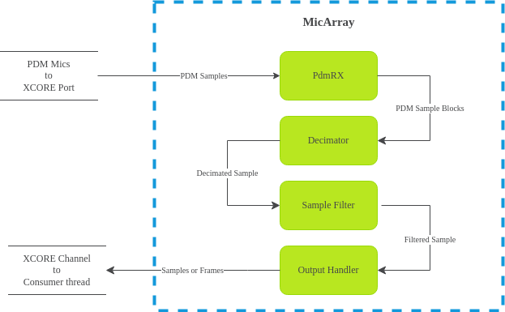

.. _software_structure:

Software Structure
==================
 
The core of ``lib_mic_array`` are a set of C++ class templates representing the
mic array unit and its sub-components. 

The template parameters of these class templates are (mainly) used for two
different purposes. Non-type template parameters are used to specify certain
quantitative configuration values, such as the number of microphone channels or
the second stage decimator tap count. Type template parameters, on the other
hand, are used for configuring the behavior of sub-components.

High-Level View
---------------

At the heart of the mic array API is the 
:cpp:class:`MicArray <mic_array::MicArray>` class template.

.. note::
  
  All classes and class templates mentioned are in the ``mic_array`` C++ 
  namespace unless otherwise specified. Additionally, this documentation may
  refer to class templates (e.g. ``MicArray``) with unbound template 
  parameters as "classes" when doing so is unlikely to lead to confusion.

The :cpp:class:`MicArray <mic_array::MicArray>` class template looks like the
following:

.. code-block:: c++

  template <unsigned MIC_COUNT,
            class TDecimator,
            class TPdmRx, 
            class TSampleFilter, 
            class TOutputHandler> 
  class MicArray;

Here the non-type template parameter ``MIC_COUNT`` indicates the number of
microphone channels to be captured and processed by the mic array unit. Most of
the class templates have this as a parameter.

A ``MicArray`` object comprises 4 sub-components:

+-----------------------------------------------------------------+-------------------------+--------------------------------+
| Member Field                                                    | Component Class         | Responsibility                 |
+=================================================================+=========================+================================+
| :cpp:member:`PdmRx <mic_array::MicArray::PdmRx>`                | ``TPdmRx``              | Capturing PDM data from a port.|
+-----------------------------------------------------------------+-------------------------+--------------------------------+
| :cpp:member:`Decimator <mic_array::MicArray::Decimator>`        | ``TDecimator``          | 2-stage decimation on blocks of| 
|                                                                 |                         | PDM data.                      |
+-----------------------------------------------------------------+-------------------------+--------------------------------+
| :cpp:member:`SampleFilter <mic_array::MicArray::SampleFilter>`  | ``TSampleFilter``       | Post-processing of decimated   |
|                                                                 |                         | samples.                       |
+-----------------------------------------------------------------+-------------------------+--------------------------------+
| :cpp:member:`OutputHandler <mic_array::MicArray::OutputHandler>`| ``TOutputHandler``      | Transferring audio data to     |
|                                                                 |                         | subsequent pipeline stages.    |
+-----------------------------------------------------------------+-------------------------+--------------------------------+

Each of the ``MicArray`` sub-components has a type that is specified as a
template parameter when the class template is instantiated. ``MicArray``
requires the class of each of its sub-components to implement a certain minimal
interface. The ``MicArray`` object interacts with its sub-components using this
interface.

.. note::
  
  Abstract classes are **not** used to enforce this interface contract. Instead, 
  the contract is enforced (at compile time) solely in how the ``MicArray`` 
  object makes use of the sub-component.

The following diagram conceptually captures the flow of information through the
``MicArray`` sub-components.

.. note::

  ``MicArray`` does not enforce the use of an XCore port for collecting PDM 
  samples or an XCore channel for transferring processed data. This is just the 
  typical usage.

Mic Array / Decimator Thread
****************************

Aside from aggregating its sub-components into a single logical entity, the
``MicArray`` class template also holds the high-level logic for capturing, 
processing and coordinating movement of the audio stream data.

The following code snippet is the implementation for the main mic array thread
(or "decimation thread"; not to be confused with (optional) PDM capture thread).

.. code-block:: c++

  void mic_array::MicArray<MIC_COUNT,TDecimator,TPdmRx,
                                    TSampleFilter,
                                    TOutputHandler>::ThreadEntry() 
  {
    int32_t sample_out[MIC_COUNT] = {0};

    while(1){
      uint32_t* pdm_samples = PdmRx.GetPdmBlock();
      Decimator.ProcessBlock(sample_out, pdm_samples);
      SampleFilter.Filter(sample_out);
      OutputHandler.OutputSample(sample_out);
    }
  }

The thread loops forever, and on each iteration

* Requests a block of PDM sample data from the PDM rx service. This is a
  blocking call which only returns once a complete block becomes
  available.
* Passes the block of PDM sample data to the decimator to produce a single
  output sample.
* Applies a post-processing filter to the sample data.
* Passes the processed sample to the output handler to be transferred to the
  next stage of the processing pipeline. This may also be a blocking call, only
  returning once the data has been
  transferred.

Note that the ``MicArray`` object doesn't care how these steps are actually
implemented. For example, one output handler implementation may send samples
one at a time over a channel. Another output handler implementation may collect
samples into frames, and use a FreeRTOS queue to transfer the data to another
thread.

.. _crtp:

Curiously Recurring Template Pattern
************************************

The C++ API of this library makes heavy use of the `Curiously Recurring Template
Pattern <https://en.wikipedia.org/wiki/Curiously_recurring_template_pattern>`_ 
(CRTP).

Instead of providing flexibility through abstract classes or polymorphism, CRTP
achieves flexibility through the use of class templates with type template
parameters. As with derived classes and virtual methods, the CRTP template
parameter must follow a contract with the class template where it implements
one or more methods with specific names and signatures that the class template
directly calls.

There are a couple notable advantages of using CRTP over polymorphic behavior.
With CRTP flexibility does not generally come with the same run-time costs (in
terms of both compute and memory) as polymorphic solutions. This is because the
CRTP class template always knows the concrete type of any objects it uses at
compile time. This avoids the need for run time type information or virtual
function tables. This allows compile time optimizations can be made which may
not be otherwise available. This in-turn allows many function calls to be
inlined, or in some cases, entirely eliminated.

Additionally, while not strictly an example of CRTP, integer template parameters
are also heavily used in class templates. The two main advantages of this are
that it allows objects to encapsulate their own (statically allocated) memory,
and that it allows the compiler to make compile time loop optimizations that it
may not otherwise be able to make.

The downside to CRTP is that it tends to lead to highly verbose class type
names, where templated classes end up with type parameter assignments are
themselves templated classes with their own template parameters.

Sub-Component Initialization
****************************

Each of ``MicArray``'s sub-components may have implementation-specific 
configuration or initialization requirements. Each sub-component is a ``public``
member of ``MicArray`` (see table above). An application can access a 
sub-component directly to perform any type-specific initialization or other
manipulation.

For example, the 
:cpp:class:`ChannelFrameTransmitter <mic_array::ChannelFrameTransmitter>` output 
handler class needs to know the ``chanend`` to be used for sending samples. This 
can be initialized on a ``MicArray`` object ``mics`` with 
``mics.OutputHandler.SetChannel(c_sample_out)``.

Sub-Components
--------------

PdmRx
*****

:cpp:member:`PdmRx <mic_array::MicArray::PdmRx>`, or the PDM rx service is the
``MicArray`` sub-component responsible for capturing PDM sample data, assembling
it into blocks, and passing it along so that it can be decimated.

The ``MicArray`` class requires only that ``PdmRx`` implement ``GetPdmBlock()``,
a blocking call that returns a pointer to a block of PDM data which is ready for
further processing.

Generally speaking, ``PdmRx`` will derive from the 
:cpp:class:`PdmRxService <mic_array::PdmRxService>` 
class template. ``PdmRxService`` encapsulates the logic of using an xCore
``port`` for capturing PDM samples one word (32 bits) at a time, and managing
two buffers where blocks of samples are collected. It also simplifies the logic
of running PDM rx as either an interrupt or as a stand-alone thread.

``PdmRxService`` has 2 template parameters. The first is the ``BLOCK_SIZE``,
which specifies the size of a PDM sample block (in words). The second,
``SubType``, is the type of the sub-class being derived from ``PdmRxService``.
This is the CRTP (Curiously Recurring Template Pattern), which allows a base
class to use polymorphic-like behaviors while ensuring that all types are known
at compile-time, avoiding the drawbacks of using virtual functions.

There is currently one class template which derives from ``PdmRxService``,
called :cpp:class:`StandardPdmRxService <mic_array::StandardPdmRxService>`.
``StandardPdmRxService`` uses a streaming channel to transfer PDM blocks to the
decimator. It also provides methods for installing an optimized ISR for PDM
capture.

Decimator
*********

The :cpp:member:`Decimator <mic_array::MicArray::Decimator>` sub-component
encapsulates the logic of converting blocks of PDM samples into PCM samples. The
:cpp:class:`TwoStageDecimator <mic_array::TwoStageDecimator>` class is a 
decimator implementation that uses a pair of decimating FIR filters to
accomplish this.

The first stage has a fixed tap count of ``256`` and a fixed decimation factor
of ``32``. The second stage has a configurable tap count and decimation factor.

For more details, see :ref:`decimator_stages`.

SampleFilter
************

The :cpp:member:`SampleFilter <mic_array::MicArray::SampleFilter>` sub-component
is used for post-processing samples emitted by the decimator. Two
implementations for the sample filter sub-component are provided by this
library.

The :cpp:class:`NopSampleFilter <mic_array::NopSampleFilter>` class can be used
to effectively disable per-sample filtering on the output of the decimator. It
does nothing to the samples presented to it, and so calls to it can be optimized
out during compilation.

The :cpp:class:`DcoeSampleFilter <mic_array::DcoeSampleFilter>` class is used
for applying the DC offset elimination filter to the decimator's output. The DC
offset elimination filter is meant to ensure the sample mean for each channel
tends toward zero.

For more details, see :ref:`sample_filters`.

OutputHandler
*************

The :cpp:member:`OutputHandler <mic_array::MicArray::OutputHandler>`
sub-component is responsible for transferring processed sample data to
subsequent processing stages.

There are two main considerations for output handlers. The first is whether 
audio data should be transferred *sample-by-sample* or as *frames* containing
many samples. The second is the method of actually transferring the audio data.

The class 
:cpp:class:`ChannelSampleTransmitter <mic_array::ChannelSampleTransmitter>` 
sends samples one at a time to subsequent processing stages using an xCore
channel.

The :cpp:class:`FrameOutputHandler <mic_array::FrameOutputHandler>` class
collects samples into frames, and uses a frame transmitter to send the frames
once they're ready.

Prefabs
-------

One of the drawbacks to broad use of class templates is that concrete class
names can unfortunately become excessively verbose and confusing. For example,
the following is the fully qualified name of a (particular) concrete
``MicArray`` implementation:

.. code-block:: c++

  mic_array::MicArray<2,  
      mic_array::TwoStageDecimator<2,6,65>, 
      mic_array::StandardPdmRxService<2,2,6>, 
      mic_array::DcoeSampleFilter<2>, 
      mic_array::FrameOutputHandler<2,256,
          mic_array::ChannelFrameTransmitter>>

This library also provides a C++ namespace ``mic_array::prefab`` which is
intended to simplify construction of ``MicArray`` objects where common
configurations are needed.

The :cpp:class:`BasicMicArray <mic_array::prefab::BasicMicArray>` class template
uses the most typical component implementations, where PDM rx can be run as an
interrupt or as a stand-alone thread, and where audio frames are transmitted to
subsequent processing stages using a channel.

To demonstrate how ``BasicMicArray`` simplifies this process, observe that the
following ``MicArray`` type is behaviorally identical to the above:

.. code-block:: c++

  mic_array::prefab::BasicMicArray<2,256,true>

